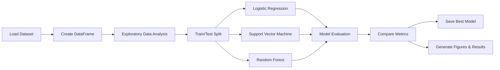
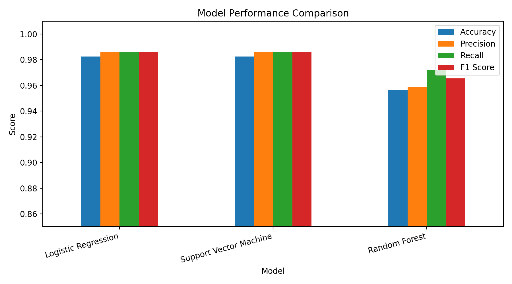
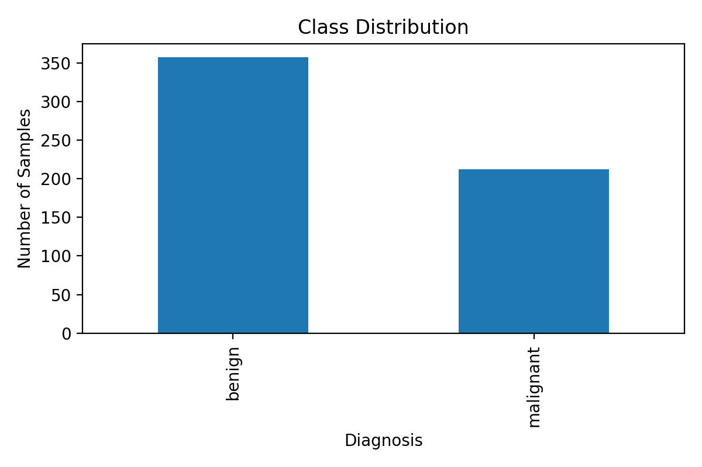
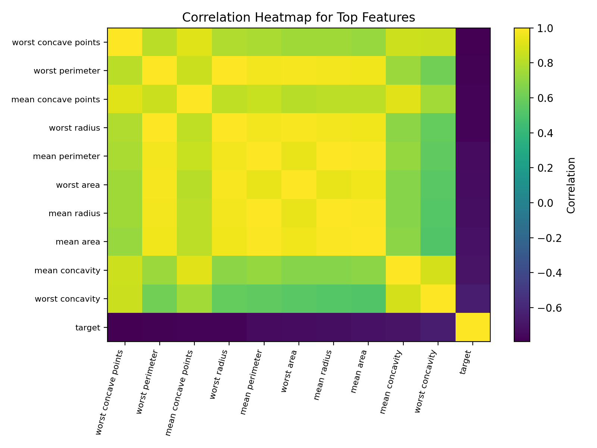
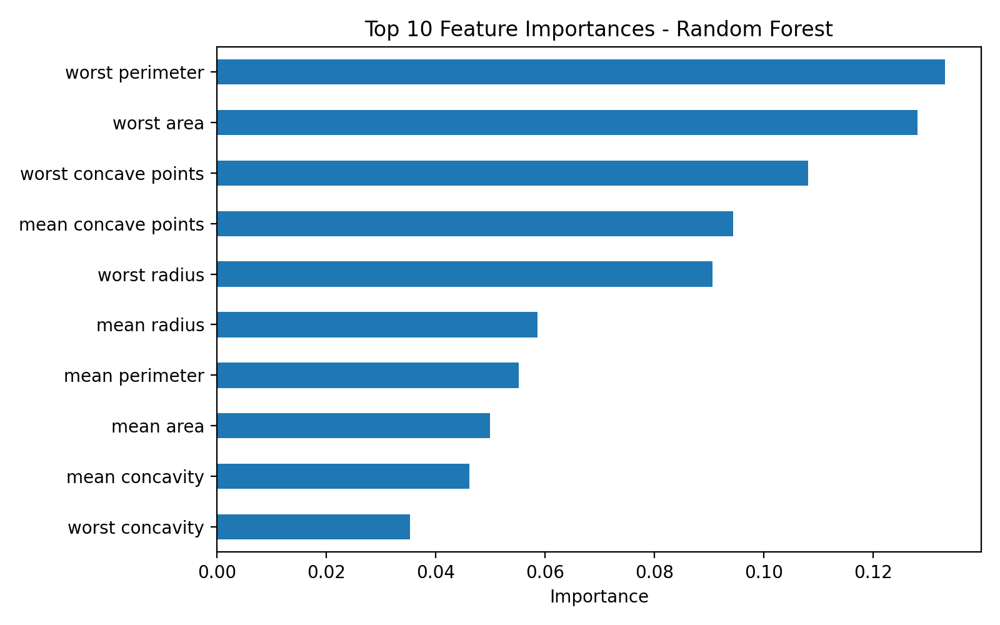
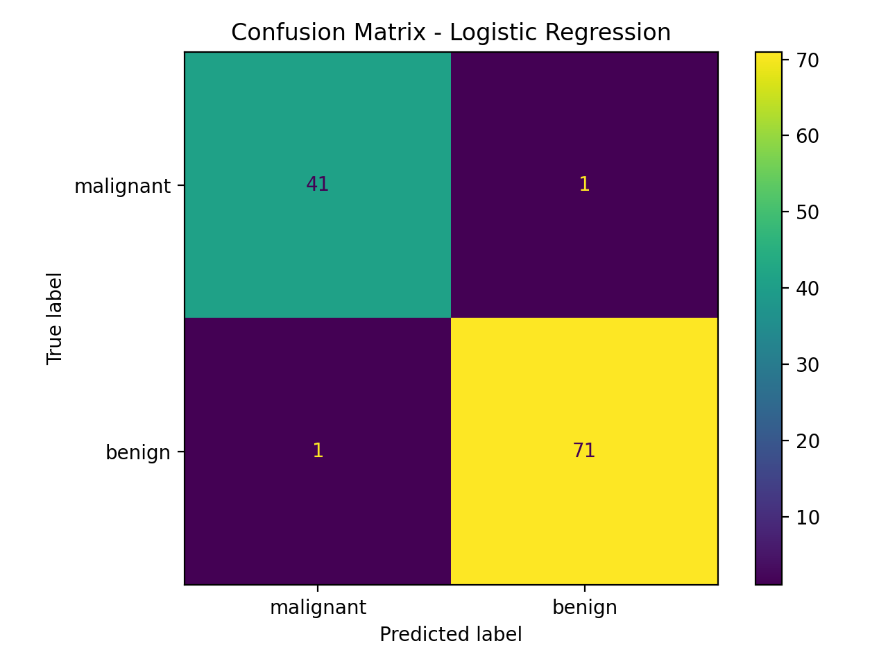

# 🧠 AI-Based Disease Prediction System

<div align="center">

**Machine Learning for Breast Cancer Classification**

A complete end-to-end Artificial Intelligence course project that explores, preprocesses, models, evaluates, and compares multiple machine-learning algorithms using the **Breast Cancer Wisconsin Diagnostic Dataset**.

<br>


<br>

**Student:** AHMAD YOUSEF NEMER AYAAD  
**Student ID:** 243039  
**Course:** Artificial Intelligence Course Project

</div>

---

## 📌 Table of Contents

- [Project Overview](#-project-overview)
- [Problem Statement](#-problem-statement)
- [Project Objectives](#-project-objectives)
- [Dataset](#-dataset)
- [Machine Learning Workflow](#-machine-learning-workflow)
- [Models Used](#-models-used)
- [Results](#-results)
- [Visualizations](#-visualizations)
- [Project Structure](#-project-structure)
- [Installation](#-installation)
- [How to Run](#-how-to-run)
- [Generated Outputs](#-generated-outputs)
- [Technologies](#-technologies)
- [Key Findings](#-key-findings)
- [Limitations](#-limitations)
- [Future Work](#-future-work)
- [Academic Note](#-academic-note)
- [Author](#-author)

---

## 🚀 Project Overview

This project develops an **AI-based disease prediction system** using supervised machine learning to classify breast tumors as either **malignant** or **benign**.

The project follows a complete machine-learning pipeline:

> **Problem Definition → Data Collection → Exploratory Data Analysis → Preprocessing → Model Training → Evaluation → Comparison → Model Saving**

Three classification algorithms are implemented and compared:

1. **Logistic Regression**
2. **Support Vector Machine (SVM)**
3. **Random Forest**

The final system evaluates the models using multiple performance metrics and automatically saves the best-performing model for future use.

> [!IMPORTANT]
> This project is intended for **academic and educational purposes only**. It is not a medical diagnostic tool and should not be used to make real-world clinical decisions.

---

## 🎯 Problem Statement

Breast cancer is one of the most widely studied medical classification problems in machine learning. Diagnostic measurements extracted from cell nuclei can contain patterns that help distinguish malignant tumors from benign tumors.

The goal of this project is to answer the following question:

> **Can machine-learning models accurately classify breast tumors as malignant or benign using numerical diagnostic features?**

---

## ✅ Project Objectives

The main objectives are to:

- Explore and understand a real-world medical dataset.
- Analyze the distribution and relationships between diagnostic features.
- Detect missing values and inspect statistical properties.
- Prepare the data for machine-learning algorithms.
- Train and compare at least two classification models.
- Evaluate models using **Accuracy, Precision, Recall, and F1 Score**.
- Apply **5-fold cross-validation** to evaluate model stability.
- Visualize confusion matrices and model performance.
- Analyze Random Forest feature importance.
- Automatically save the best model as a reusable `.pkl` file.
- Produce reproducible results, figures, and reports.

---

## 📊 Dataset

The project uses the **Breast Cancer Wisconsin Diagnostic Dataset** provided through `scikit-learn` and originally associated with the **UCI Machine Learning Repository**.

### Dataset Summary

| Property | Value |
|---|---:|
| Number of samples | **569** |
| Number of input features | **30** |
| Target classes | **2** |
| Malignant label | `0` |
| Benign label | `1` |
| Missing values | **None** |

The features describe properties of cell nuclei, including measurements related to:

- Radius
- Texture
- Perimeter
- Area
- Smoothness
- Compactness
- Concavity
- Concave points
- Symmetry
- Fractal dimension

The script exports a local CSV copy to:

```text
dataset/breast_cancer_dataset.csv
```

---

## 🔄 Machine Learning Workflow



### 1. Data Loading

The dataset is loaded directly using:

```python
from sklearn.datasets import load_breast_cancer
```

It is then converted to a `pandas.DataFrame` for easier analysis.

### 2. Exploratory Data Analysis

The program automatically generates:

- Descriptive statistical summaries
- Missing-value analysis
- Class distribution visualization
- Correlation analysis
- Feature boxplots

### 3. Train/Test Split

The dataset is divided into:

- **80% training data**
- **20% testing data**

A fixed `random_state=42` is used for reproducibility, with stratification to preserve the class distribution.

### 4. Feature Scaling

`StandardScaler` is applied in pipelines for:

- Logistic Regression
- Support Vector Machine

Random Forest does not require feature scaling.

### 5. Model Evaluation

Each model is evaluated using:

- Accuracy
- Precision
- Recall
- F1 Score
- 5-fold Cross-Validation F1 Mean
- Cross-Validation Standard Deviation
- Confusion Matrix
- Classification Report

---

## 🤖 Models Used

### Logistic Regression

A strong linear baseline classifier. Because feature scales vary considerably, the model is trained inside a pipeline with `StandardScaler`.

### Support Vector Machine

An SVM with an **RBF kernel** is used to capture nonlinear decision boundaries. Standardization is also applied before training.

### Random Forest

An ensemble model containing **200 decision trees**. Random Forest additionally provides feature-importance values that help identify influential diagnostic measurements.

---

## 🏆 Results

The models produced the following test-set results:

| Model | Accuracy | Precision | Recall | F1 Score | CV F1 Mean |
|---|---:|---:|---:|---:|---:|
| **Logistic Regression** | **98.25%** | **98.61%** | **98.61%** | **98.61%** | **98.43%** |
| **Support Vector Machine** | **98.25%** | **98.61%** | **98.61%** | **98.61%** | **97.73%** |
| Random Forest | 95.61% | 95.89% | 97.22% | 96.55% | 96.84% |

### 🥇 Best Model

Based on the implementation's F1-score selection logic, **Logistic Regression** is saved as the best model.

```text
models/best_model.pkl
```

> Logistic Regression and SVM achieved the same test F1 score. Logistic Regression is selected because it is encountered first by the program when the best-score comparison is performed.

---

## 📈 Visualizations

The repository includes automatically generated visualizations.

### Model Performance Comparison



### Class Distribution



### Correlation Heatmap



### Random Forest Feature Importance



### Confusion Matrices

<table>
<tr>
<td align="center"><b>Logistic Regression</b></td>
<td align="center"><b>Support Vector Machine</b></td>
</tr>
<tr>
<td></td>
<td></td>
</tr>
</table>

### Random Forest Confusion Matrix


---

## 🧬 Most Important Features

According to Random Forest feature importance, several of the most influential variables include:

| Rank | Feature | Importance |
|---:|---|---:|
| 1 | worst perimeter | 0.1331 |
| 2 | worst area | 0.1281 |
| 3 | worst concave points | 0.1081 |
| 4 | mean concave points | 0.0944 |
| 5 | worst radius | 0.0906 |
| 6 | mean radius | 0.0587 |
| 7 | mean perimeter | 0.0552 |
| 8 | mean area | 0.0499 |
| 9 | mean concavity | 0.0462 |
| 10 | worst concavity | 0.0354 |

These values are generated from the trained Random Forest model and saved in:

```text
results/top_feature_importance.csv
```

---

## 📁 Project Structure

```text
243039_AHMAD_YOUSEF_NEMER_AYAAD_AIProject/
│
├── README.md
├── requirements.txt
│
├── dataset/
│   └── breast_cancer_dataset.csv
│
├── source_code/
│   └── AI_Disease_Prediction_System.py
│
├── figures/
│   ├── class_distribution.png
│   ├── correlation_heatmap.png
│   ├── boxplot_mean_radius.png
│   ├── boxplot_mean_texture.png
│   ├── boxplot_mean_concavity.png
│   ├── boxplot_worst_radius.png
│   ├── model_comparison.png
│   ├── feature_importance.png
│   ├── confusion_matrix_logistic_regression.png
│   ├── confusion_matrix_support_vector_machine.png
│   └── confusion_matrix_random_forest.png
│
├── results/
│   ├── data_summary.csv
│   ├── missing_values.csv
│   ├── model_metrics.csv
│   ├── classification_reports.json
│   └── top_feature_importance.csv
│
├── models/
│   └── best_model.pkl
│
├── report/
│   └── AI_Disease_Prediction_Report_AHMAD_AYAAD.docx
│
└── presentation/
    └── AI_Disease_Prediction_Presentation_AHMAD_AYAAD.pptx
```

---

## ⚙️ Installation

### Prerequisites

Make sure Python 3 is installed.

Clone the repository:

```bash
git clone <YOUR-REPOSITORY-URL>
cd 243039_AHMAD_YOUSEF_NEMER_AYAAD_AIProject
```

Install the required packages:

```bash
pip install -r requirements.txt
```

### Dependencies

```text
pandas
numpy
matplotlib
scikit-learn
joblib
```

---

## ▶️ How to Run

### Option 1 — Spyder IDE

This project was designed to be easy to run in **Spyder**.

1. Open Spyder.
2. Open:

```text
source_code/AI_Disease_Prediction_System.py
```

3. Run the script.
4. Check the console for model metrics.
5. Generated files are automatically stored in `dataset/`, `figures/`, `results/`, and `models/`.

### Option 2 — Terminal

From the project root, run:

```bash
python source_code/AI_Disease_Prediction_System.py
```

---

## 📦 Generated Outputs

Running the project produces or updates:

| Output | Location |
|---|---|
| Dataset CSV | `dataset/` |
| EDA figures | `figures/` |
| Confusion matrices | `figures/` |
| Model comparison chart | `figures/` |
| Statistical summary | `results/` |
| Missing-value report | `results/` |
| Model metrics | `results/` |
| Classification reports | `results/` |
| Feature importance | `results/` |
| Best trained model | `models/best_model.pkl` |

---

## 🛠️ Technologies

| Technology | Purpose |
|---|---|
| **Python** | Main programming language |
| **pandas** | Data manipulation and analysis |
| **NumPy** | Numerical operations |
| **Matplotlib** | Data visualization |
| **scikit-learn** | Dataset, preprocessing, ML models, and evaluation |
| **joblib** | Saving the trained model |
| **Spyder IDE** | Intended development environment |

---

## 💡 Key Findings

- Logistic Regression and SVM achieved the strongest test performance.
- Both reached an F1 Score of approximately **98.61%**.
- Logistic Regression also obtained a strong 5-fold CV F1 mean of approximately **98.43%**.
- Random Forest achieved slightly lower overall performance, but provided valuable feature-importance information.
- Measurements related to tumor perimeter, area, radius, and concave points were among the most influential Random Forest features.
- Scaling is important for Logistic Regression and SVM due to differences in feature ranges.
- The high classification performance shows that the dataset contains strong predictive patterns, although results from this academic dataset must not be interpreted as clinical validation.

---

## ⚠️ Limitations

This project has several limitations:

- The dataset is relatively small.
- It represents a specific diagnostic dataset and may not generalize to different populations or clinical environments.
- Hyperparameter optimization is limited.
- The saved model is intended for demonstration and coursework.
- No independent external clinical validation is performed.
- Model predictions should **not** be interpreted as medical advice.

---

## 🔮 Future Work

Possible improvements include:

- Apply `GridSearchCV` or `RandomizedSearchCV` for hyperparameter tuning.
- Add ROC curves and AUC comparison.
- Add additional algorithms such as K-Nearest Neighbors, XGBoost, or Gradient Boosting.
- Use SHAP or other explainability techniques.
- Build an interactive Streamlit interface.
- Add a prediction form for demonstration purposes.
- Add automated unit tests.
- Add GitHub Actions for continuous integration.
- Deploy the model as a small educational web application.
- Evaluate the approach on additional datasets.

---

## 🎓 Academic Note

This repository demonstrates the complete workflow required for the Artificial Intelligence course project, including:

- Problem definition
- Dataset analysis
- Data preprocessing
- Machine-learning modeling
- Model comparison
- Evaluation and discussion
- Documentation
- Presentation materials

The repository is structured so that every output can be traced back to the Python implementation.

---

## 👨‍💻 Author

<div align="center">

### AHMAD YOUSEF NEMER AYAAD

**Student ID:** `243039`

Artificial Intelligence Course Project

<br>

⭐ **If you find this project useful, consider starring the repository.**

</div>

---

<div align="center">

### 🧠 Built with Python & Machine Learning

**From raw data to trained models, evaluation, visualization, and documentation.**

</div>
